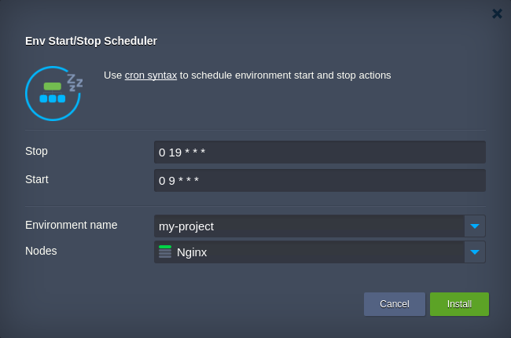
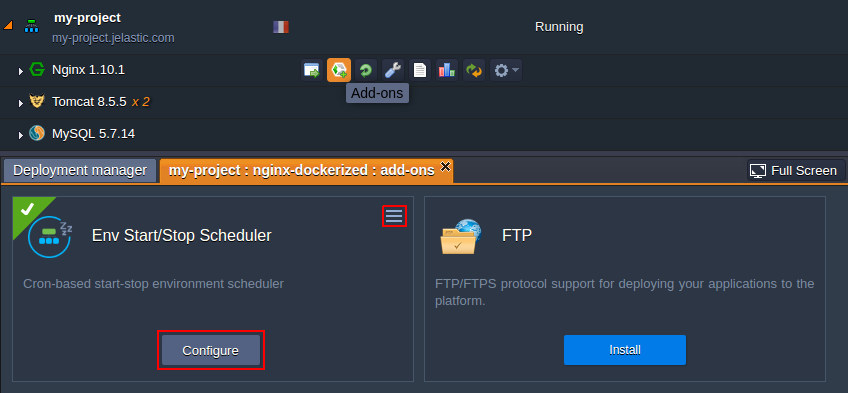

# Environment Start/Stop Scheduler Add-On

The **Env Start/Stop Scheduler** add-on is intended to automatically shut down and relaunch an environment based on the prescribed timing instructions. The appropriate UTC-based timestamps (when the environment state should be switched) are defined with [cron syntax](https://en.wikipedia.org/wiki/Cron#Overview). Such automated environment lifecycle management allows to cut spends on testing and dev projects by turning them off when no development is carried out (e.g. during night-time).

The scheduler can be applied to any environment within your [Jelastic Cloud](https://jelastic.cloud/) account starting from 4.10 Platform version and is completely free to use.

For more information about [Jelastic Add-Ons](https://github.com/jelastic-jps/jpswiki/wiki/Jelastic-Addons) and their usage, refer to the linked guide.

## How to Apply Environment Start/Stop Scheduling

Copy link to the **_manifest.jps_** file above and [import](https://docs.jelastic.com/environment-import) it to your Jelastic dashboard (or, alternatively, locate and launch this package via [Jelastic Marketplace](https://docs.jelastic.com/marketplace)).

Within the installation frame, specify the following data:
- **Stop / Start** - [cron trigger](https://en.wikipedia.org/wiki/Cron#Overview) conditions that are specified respectively to the UTC time zone (5 characters each) and can be left blank to skip the corresponding action
- **Environment name** - target environment that should be managed by the add-on
- **Nodes** - [environment layer](https://docs.jelastic.com/jelastic-basic-hosting-concepts#layer) the add-on will be installed to (is fetched automatically upon selecting the environment)

**Note:** The current scheduler implementation implies the complete stop of all containers in the destination environment 
(rather than container [hibernation](https://docs.jelastic.com/resources-utilization), which can be automatically 
interrupted upon any incoming request); thus, all the corresponding environment services will remain unavailable 
until it is launched again, either by the scheduler or manually. 

Click **Install** to initiate the scheduler integration.

## Managing Start/Stop Scheduler

In case you need to change the initial *Stop* and *Start* trigger conditions, click the **Add-ons** button next to the server it was installed to and select **Configure** at the appropriate scheduler plank (alternatively, the same could be applied with add-on re-installation).

In case this solution is not needed any more, use the menu at the top-right corner of the same plank to **Uninstall** it.
